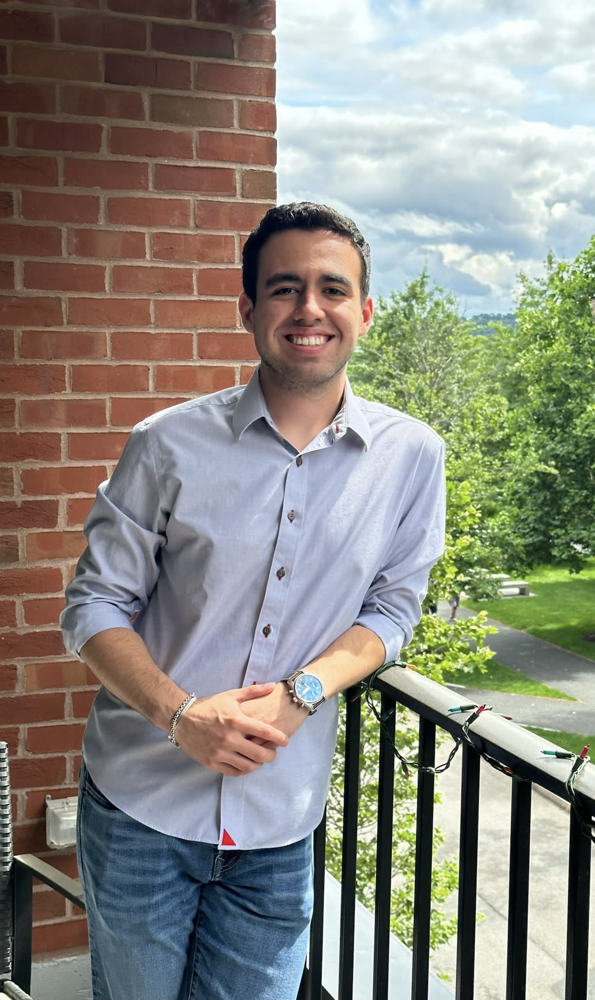

## About Me

Aspiring entrepreneur and scientist hoping to build products that improve the world.

I'm currently a first-year PhD student in Harvard's Biophysics Program.

## Research Interests

 My current research interests lie in protein structure, function, and design. I am interested in leveraging existing structural determination methods (e.g. X-ray crystallography, cryogenic electron microscopy, and NMR) and machine learning models (e.g. AlphaFold3, RFDiffusion, and ProteinMPNN) to accelerate drug discovery.

## Work Experience

- **Farnung Lab Rotation Student at Harvard Medical School (November 2024 - February 2025).** I learned how to perform **in vitro** transcription assays, reconstitute protein complexes **in vitro**, prepare biological samples for single-particle cryo-EM, and process cryo-EM datasets using cryoSPARC. I also learned how to prepare and run native DNA/RNA gels, how to perform large-scale PCRs, and how to use an AKTA. Lastly, I learned how to build and analyze atomic models using generative AI software like ModelAngelo and CryFold, as well as structural analysis software like MolProbity. 

- **Hekstra Lab Rotation Student at Harvard (August-October 2024).** I built a prototype of a 3D “crystal packer” for designing protein crystals *in silico*. This involved working with Python libraries such as gemmi, biopython, and SFCalculator. I also worked with RPXDock, a protein docking software developed by David Baker's lab.

- **Gaudet Lab Undergraduate Researcher at Harvard (June 2021-May 2024).** I focused on resolving the structure of an NRAMP-like membrane protein that is expressed in *Eggerthella lenta* using X-ray crystallography. I gained experience expressing and purifying membrane proteins, setting up LCP crystallization trials and screens, conducting protein expression tests via a Western Blot, optimizing protein purification protocols, screening conditions to obtain high-quality protein crystals, and presenting my data in lab meetings and research conferences.

- **Discovery Biologics/Rosetta Intern at Merck (May-July 2023).** Used PyRosetta and machine learning models, such as RFdiffusion, ProteinMPNN, AlphaFold2 Multimer, and OmegaFold, to redesign a TGF-Beta type-I receptor. Wrote python scripts to extract and analyze data. Gave a seminar to present my work and presented a poster at RosettaCON. Collaborated with colleagues to establish a pipeline for designing protein binders.

## Awards

1. Lawrence J. Henderson Prize—for the most meritorious senior thesis in the Molecular and Cellular Biology Department at Harvard

2. Marci and Martin Karplus Family Foundation Biophysics Prize Fellowship—awarded annually to one first-year Harvard Biophysics PhD student.

## Website

The template for this website can be found [here](https://github.com/ankitsultana/researcher).
